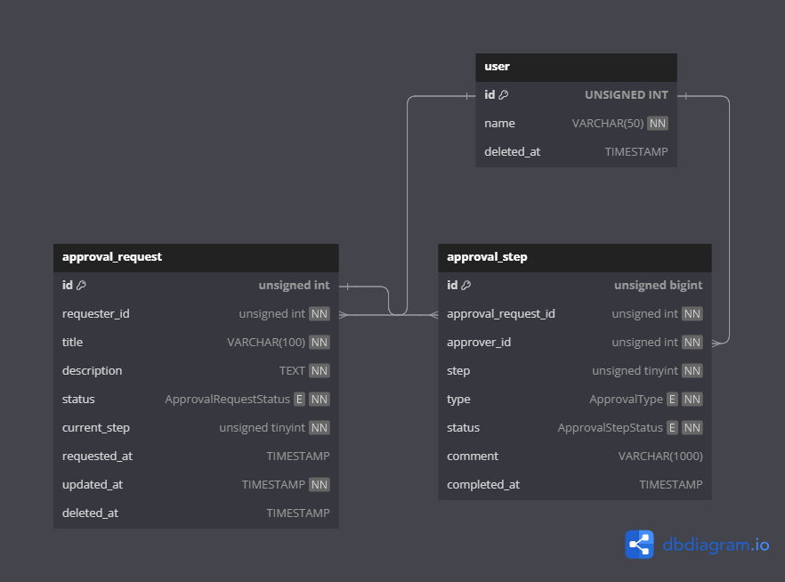

# Solution 3
## 1. Schema
[ERD Link](https://dbdiagram.io/d/schoolbell-e-678cc4866b7fa355c3544e15)

##  2.Table 설계
### 1) User TABLE
- 부서 및 직급 등을 제외하고 최소한으로 설계
### 2) Approved Request Table
- 임시저장(draft)을 위한 status enum 설계
- JOIN 사용 축소를 위한 current_step 집계 컬럼 추가
### 3) Approval Step Table
- 병렬 결재(다수의 결재 또는 합의자 추가 등)를 위한 step, type의 enum 컬럼 추가

## 3. Query 설계
- 실행 최적화를 위해 서브쿼리로 특정 유저의 진행 중인 결재 단계를 먼저 조회한 후 결재 문서를 조인하여 조회